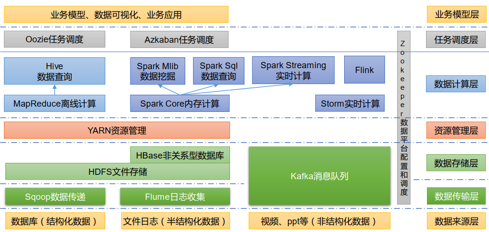

MapReduce in charge of computing
YARN in charge of resource scheduling

HDFS is a distributed file system.

Name Node (Table of Content): The server that remembers the location of every file blocks
Secondary Name Node: redundant copy the name node
Date Node (Chapters and pages): The server where the data is stored

YARN is a resource manager.
ex: A cluster includes 3 nodes
Node A: 40G Memory, 4 CPU -> Node Manager A
Node B: 40G Memory, 4 CPU -> Node Manager B
Node C: 40G Memory, 4 CPU -> Node Manager C

Resource manager manages 120G Memory and 12 CPU


What does the YARN manage? CPU and Memory
YARN has two key coponents: 
Resource Manager: Manage the resource in a cluster of nodes.
Node Manager: Manage the resource in a individual node.
Client submits job to resource manager. YARN creates 

* Resource Manager - Boss of the cluster
* Node Manager - Boss of an individual node
* Application Master - The boss of an application
* Container - managed by node managers, it is virtualized independent server. it has it own RAM, CPU, Disk and network.




MapReduce

In map phase -> each worker process a small chunk of data
In reduce paths -> summary the output of each worker and generate the result on a server that do the the summarization


Create a template linux virtual machine

What we will set in the virtual machine
1. RAM Size
2. Disk Size
3. IP Address
4. Host Name

Change the host name and host name mapping

```shell
[root@n100 ~]# cat /etc/hostname
n100
[root@n100 ~]#
[root@n100 ~]# cat /etc/hosts
127.0.0.1   localhost localhost.localdomain localhost4 localhost4.localdomain4
::1         localhost localhost.localdomain localhost6 localhost6.localdomain6
192.168.10.100  n100
192.168.10.101  n101
192.168.10.102  n102
192.168.10.103  n103
192.168.10.104  n104
192.168.10.105  n105
192.168.10.106  n106
192.168.10.107  n107
192.168.10.108  n108
192.168.10.109  n109
192.168.10.110  n110
192.168.10.111  n111
192.168.10.112  n112
192.168.10.113  n113
192.168.10.114  n114
192.168.10.115  n115

```

