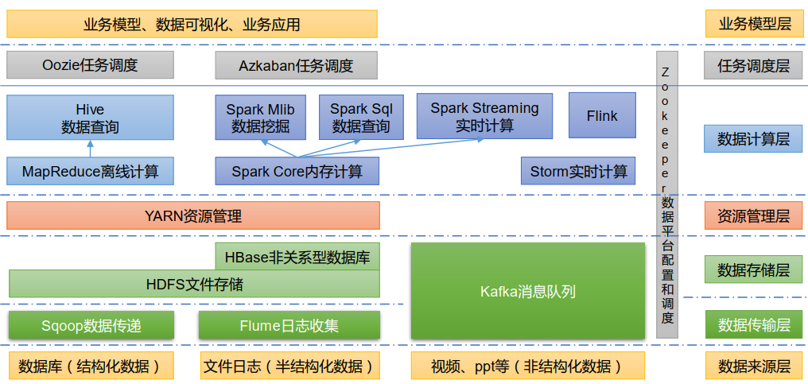

MapReduce in charge of computing
YARN in charge of resource scheduling

HDFS is a distributed file system.

Name Node (Table of Content): The server that remembers the location of every file blocks
Secondary Name Node: redundant copy the name node
Date Node (Chapters and pages): The server where the data is stored

YARN is a resource manager.
ex: A cluster includes 3 nodes
Node A: 40G Memory, 4 CPU -> Node Manager A
Node B: 40G Memory, 4 CPU -> Node Manager B
Node C: 40G Memory, 4 CPU -> Node Manager C

Resource manager manages 120G Memory and 12 CPU

What does the YARN manage? CPU and Memory
YARN has two key coponents: 
Resource Manager: Manage the resource in a cluster of nodes.
Node Manager: Manage the resource in a individual node.
Client submits job to resource manager. YARN creates 

* Resource Manager - Boss of the cluster
* Node Manager - Boss of an individual node
* Application Master - The boss of an application
* Container - managed by node managers, it is virtualized independent server. it has it own RAM, CPU, Disk and network.

MapReduce

In map phase -> each worker process a small chunk of data
In reduce paths -> summary the output of each worker and generate the result on a server that do the the summarization